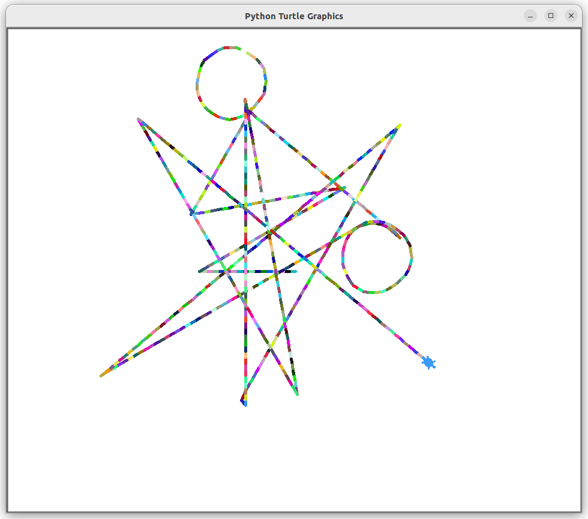

## Etch A Sketch

Program to simulates a **Etch A Sketch**  written in python.   
[Etch A Sketch](https://en.wikipedia.org/wiki/Etch_A_Sketch) is a mechanical drawing toy invented by André Cassagnes of France and subsequently manufactured by the Ohio Art Company.           
Controlled by the Left, Right, "a" and "d" keys, which moves turtle vertically and horizontally.      
           
###### It's a part of the **#100DaysOfCode** challenge by Angela Yu. ######


#### Prerequisites
You will need the following software to run the Turtle function:
 - [Python 3](https://www.python.org/downloads/)
 

#### Installation
To get started with the "Etch A Sketch", follow these steps:

1. **Clone** the repository:

```sh
git clone https://github.com/resole79/etch_a_sketch.git
```

2. **Run** the **main.py** file:

```sh
python3 main.py
```     

#### *File Structure*

 - **main.py**: Main program.


#### **Usage**

Press keys to draw with turtle:
 - Right to forward
 - Left to backwardand
 - "a" to turn left  
 - "d" to turn right

**How program present**



## **Credit**

Author : Emilio Reforgiato (resole79)

##
<p align="right"><a href="https://www.linkedin.com/in/emilio-reforgiato/" target=”_blank” ></a></p>


